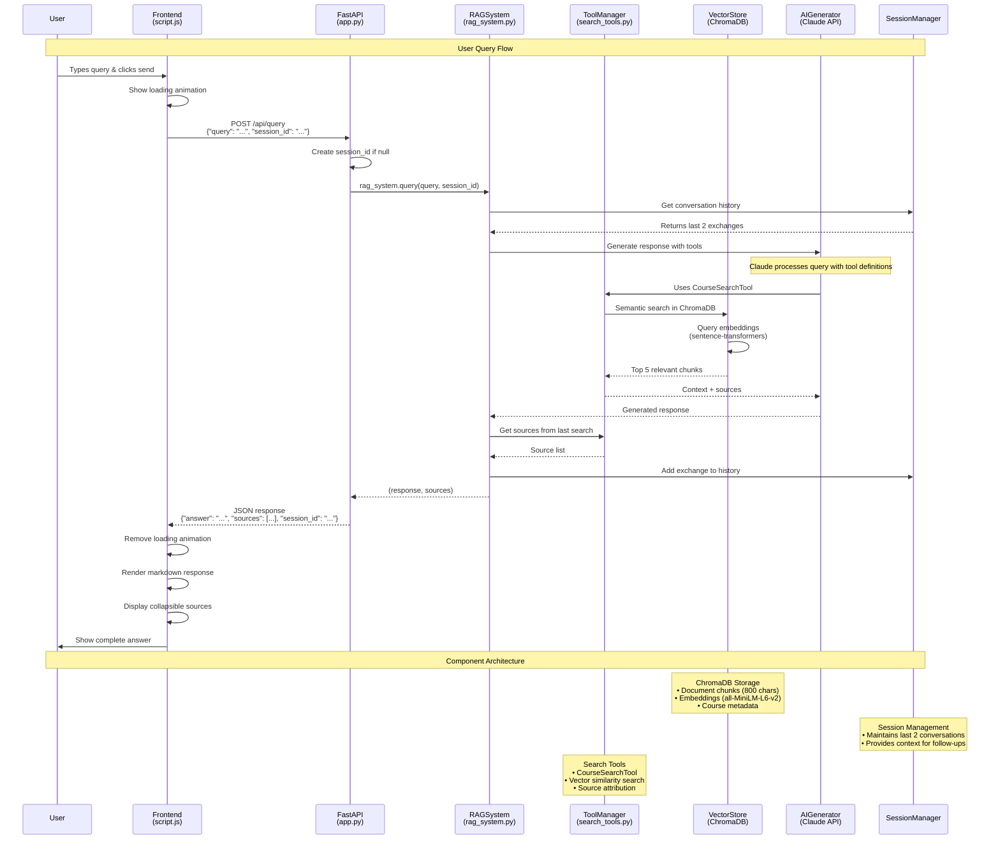

# RAG Chatbot System Flow Diagram

## Key Components

### Frontend (Vanilla JS)
- **Input Handling**: Captures user queries and manages UI state
- **API Communication**: POST requests to `/api/query` endpoint
- **Response Rendering**: Markdown parsing and source display

### Backend API (FastAPI)
- **Route Handler**: `/api/query` endpoint processes requests
- **Session Management**: Creates/maintains session IDs
- **Error Handling**: HTTP exceptions and response formatting

### RAG System Core
- **Query Orchestration**: Coordinates all components
- **Tool Integration**: Manages search tools for context retrieval
- **Response Generation**: Interfaces with Claude API

### Vector Store (ChromaDB)
- **Document Storage**: 800-character chunks with 100-char overlap
- **Embeddings**: sentence-transformers model (all-MiniLM-L6-v2)
- **Semantic Search**: Returns top 5 most relevant chunks

### AI Generator (Anthropic Claude)
- **Model**: claude-sonnet-4-20250514
- **Tool Usage**: Executes CourseSearchTool for context
- **Context Integration**: Combines query + history + retrieved content

### Session Manager
- **Conversation History**: Stores last 2 message exchanges
- **Context Continuity**: Enables follow-up questions
- **Memory Management**: Prevents context overflow

## Data Flow Summary

1. **User Input** → Frontend captures and validates
2. **API Request** → JSON payload with query and session
3. **RAG Processing** → Orchestrates search and generation
4. **Vector Search** → Finds relevant document chunks
5. **AI Generation** → Claude processes with context
6. **Response Assembly** → Combines answer with sources
7. **Frontend Display** → Renders markdown with attribution